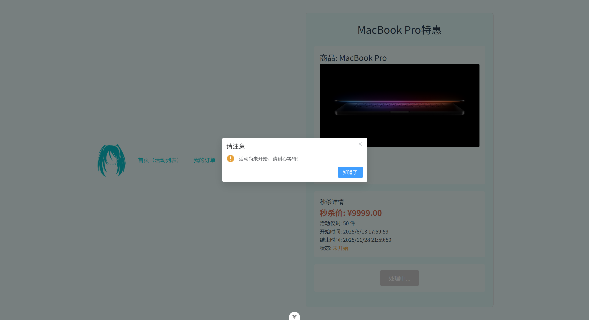
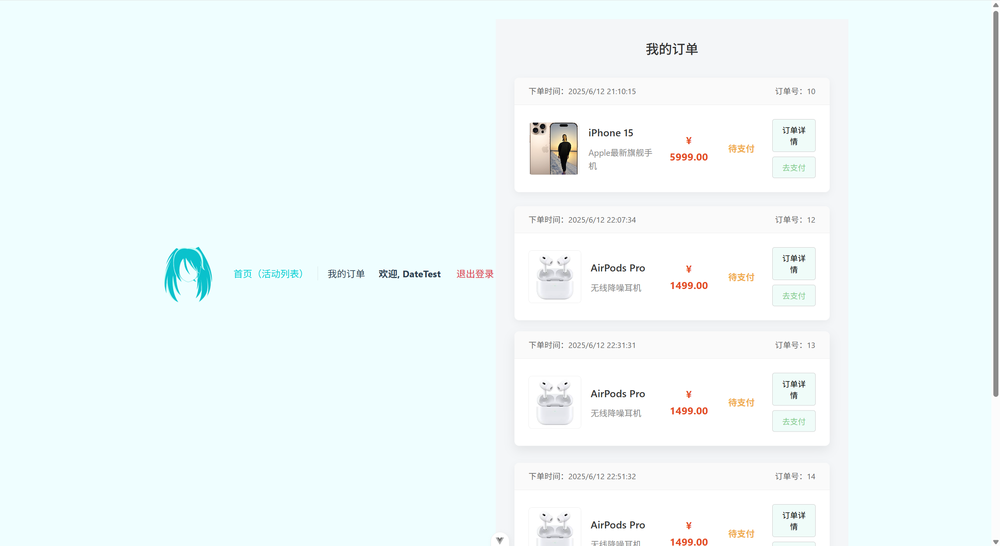
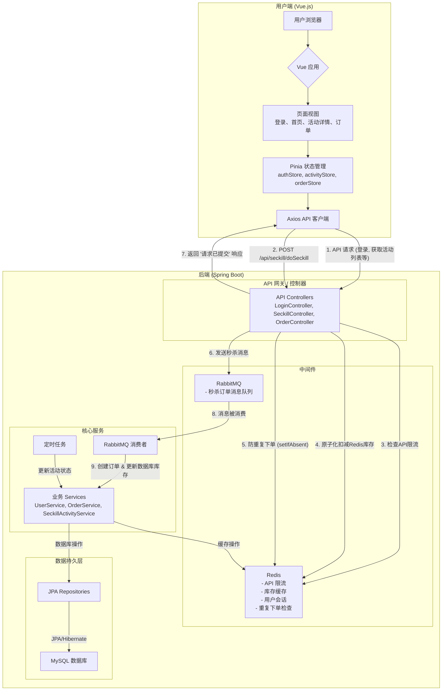

# SecKill
秒杀系统

## 已实现功能  
主页（活动列表）  
  
用户注册  
  
用户登录  
  
活动详情页查看  
    
弹窗限制用户连续提交请求   
   
订单页面列表   
   

```mermaid   
graph TD
    subgraph "用户端 (Vue.js)"
        A["用户浏览器"] --> B{"Vue 应用"};
        B --> C["页面视图<br>登录、首页、活动详情、订单"];
        C --> D["Pinia 状态管理<br>authStore, activityStore, orderStore"];
        D --> E["Axios API 客户端"];
    end

    subgraph "后端 (Spring Boot)"
        subgraph "API 网关 / 控制器"
            G["API Controllers<br>LoginController, SeckillController, OrderController"];
        end

        subgraph "中间件"
            H["Redis<br>- API 限流<br>- 库存缓存<br>- 用户会话<br>- 重复下单检查"];
            I["RabbitMQ<br>- 秒杀订单消息队列"];
        end

        subgraph "核心服务"
            J["业务 Services<br>UserService, OrderService, SeckillActivityService"];
            K["RabbitMQ 消费者"];
            L["定时任务"];
        end

        subgraph "数据持久层"
            M["JPA Repositories"];
            N["MySQL 数据库"];
        end
    end

    %% 前端到后端流程
    E -- "1. API 请求 (登录, 获取活动列表等)" --> G;

    %% 秒杀核心流程 (高并发路径)
    E -- "2. POST /api/seckill/doSeckill" --> G;
    G -- "3. 检查API限流" --> H;
    G -- "4. 原子化扣减Redis库存" --> H;
    G -- "5. 防重复下单 (setIfAbsent)" --> H;
    G -- "6. 发送秒杀消息" --> I;
    G -- "7. 返回 '请求已提交' 响应" --> E;

    %% 异步订单创建流程
    I -- "8. 消息被消费" --> K;
    K -- "9. 创建订单 & 更新数据库库存" --> J;

    %% 通用后端流程
    J -- "数据库操作" --> M;
    M -- "JPA/Hibernate" --> N;
    J -- "缓存操作" --> H;

    %% 定时任务流程
    L -- "更新活动状态" --> J;
```   